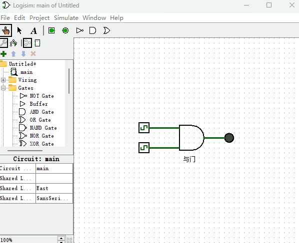
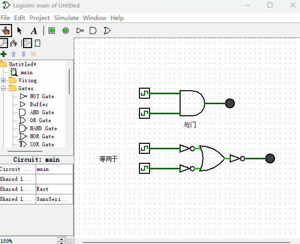
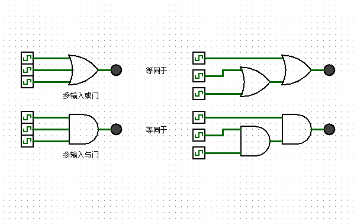

# 与门

我们要介绍的第三个逻辑门，叫做“与门”。它也有两个输入端和一个输出端。“与门”的特点是，当两个输入端值都为1的时候，输出端为1，其它情况，输出端为0。换句话说，只要有一个输入端为低电平，那么它的输出端就是低电平，只有两个输入端都是高电平的时候，它的输出端才是高电平。它的演示电路如下图所示。

“与门”实现的功能听起来是不是和“或门”有点像？只是它们输入输出的0和1是反的。其实“与门”是可以通过用“非门”和“或门”的串联组合来获得，如下图所示。

其它的“与非门”，“或非门”和“异或门”我就不介绍了，本书暂时不会用到，而且所有逻辑门都可以用“非门”和“或门”的串并联组合来获得。如果你对其它逻辑门感兴趣的话，可以自己去翻阅相关资料来学习。

另外，有的时候出于方便，你会看到有多个输入端的“与门”或者“或门”，它们只不过是由多个“与门”或者“或门”串并联组成的，比如3个输入端的“与门”和“或门”电路图就如下图所示。

本章逻辑门到此就介绍完了，那么你有想过为什么这种电子元件叫做逻辑“门”么？因为它就像一个大门，从大门进入一个信号，出去后就变成了另一个信号，所以叫做逻辑门。当你构建了数以万计的逻辑门组成的逻辑电路后，信号就像是一个小人在不同的大门里穿梭来、穿梭去。再思考下，逻辑门一定要是电子元件么？答案是不一定，如果你看过刘慈欣的“三体”里一个桥段，“秦始皇用举黑白旗帜的士兵组成一个庞大的逻辑门军队，来计算天体的运动规律”，你就会知道“逻辑门”不一定要做成电子元件，任何满足这些逻辑运算规则且具有延时性质的物体都可以当作“逻辑门”。而通过这些基础的逻辑门，我们就可以搭建起庞大的冯诺依曼计算机结构，也就是现代计算机的系统结构。再比如，“我的世界”游戏中有个红石系统，通过红石系统可以制作各种各样的逻辑门，于是，就可以在“我的世界”游戏中搭建起一个庞大的计算机系统。