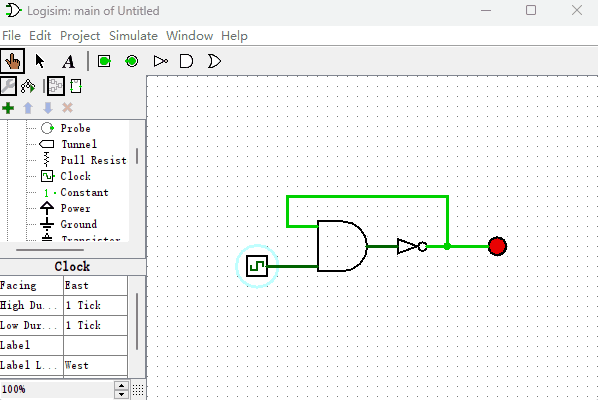
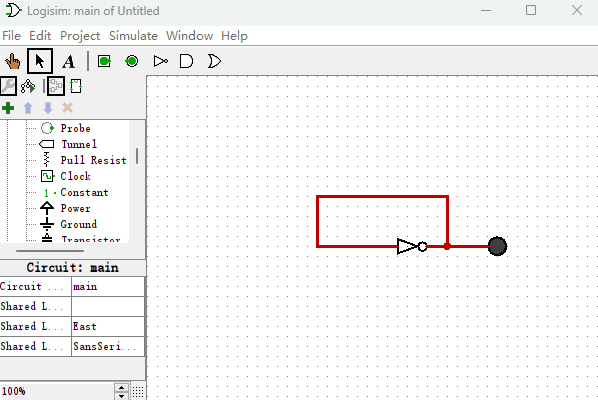

# 锁存器和触发器

有了逻辑门后，我们看看逻辑门除了能改变信号的输入输出，还能做些什么？我们先来看一个如下图所示这样的电路图，它会产生什么样的效果呢？

在上图中可以看到，当“时钟信号发生器”变成1后，产生了震荡电路，Logisim软件停止仿真并提示报错信息。为什么会这样呢？因为，当一个信号从逻辑门的输入端通过到达输出端是有延时的，当“时钟信号发生器”输出0的时候，电路处于稳定状态，非门输出端输出的是1，“LED发光二极管”被点亮。而当“时钟信号发生器”输出1的时候，整个电路可以简化如下图所示的电路图。非门的输出端直接连接到非门的输入端，由于信号有延时，所以非门的输出结果就是0101010101……信号快速震荡。当信号无法达到稳定状态，并且震荡速度超过一个阈值的时候，Logisim软件就会检测到这种震荡，并产生报错信息，然后终止模拟。通过这个实验，我想告诉你的就是，信号在逻辑门传输的过程中是有延时的，而接下来我们将利用逻辑门的这个延时特性来制作一种新的元件，为后续构建计算机系统打下基础。

