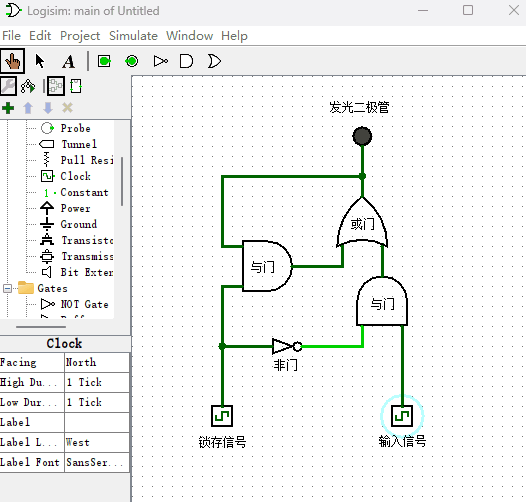
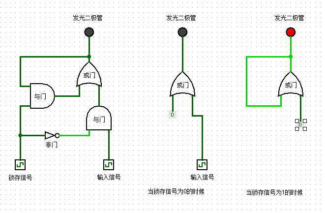
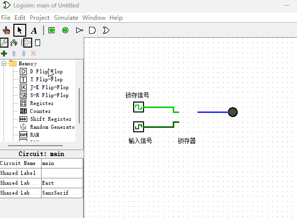

# 锁存器

上一章介绍的逻辑门的输出都会随着输入端信号的变化而变化，我们能不能设计一种元件来把输出信号锁住，这样就能够把信号存储下来了，不再受输入端信号变化的影响。这种元件就是我们本章节要制作的“锁存器”，顾名思义，“锁存器”的作用就是把信号锁住，不在受输入端信号变化的影响。下面我来看一下锁存器的电路原理图，如下图所示。

这里要提示下读者，从此刻开始电路图就变得稍微有点复杂了，你需要放慢阅读速度，耐心的观察演示电路图，直到理解原理后再继续往下阅读。言归正传，如上图所示，我们可以看到这样的结果：当锁存信号输入端为0的时候，输入信号可以直达发光二极管。当锁存信号输入端为1的时候，输出端信号就被锁住了，不受输入信号的影响，这样我们就实现了信号保存的功能。现在我们来分析下锁存器是如何实现数据保存功能的？当锁存信号输入端为0或1的时候，锁存器电路图可以简化成如下图所示电路图。

根据上面电路图所示，当锁存信号输入端为0的时候，等同于输入端信号直接传送到二极管的输入端。当锁存信号输入端为1的时候，或门的输出端连接自身的输入端，另一输入端为0，电路达到稳定状态，当从而达到锁存信号的目的。如果你有不理解的地方，要停下来慢慢看。如果觉得演示动画播放速度过快，可以把本书所使用的Logisim演示项目文件下载到本机电脑，然后自己动手打开并运行项目文件来观察电路原理。另外，这种锁存器只是用于教学目的而设计的，实际生产中并不会这样设计锁存器，因为还要考虑锁存器的稳定性等原因，实际中的锁存器设计的会稍复杂些。

现在锁存器原理我们已经学会了，由于Logisim已经给我们提供了更方便的锁存器元件，后面如果在Logisim软件里用到锁存器的话，我就直接使用Logisim软件里内置的锁存器了，它的使用方式如下图所示。

