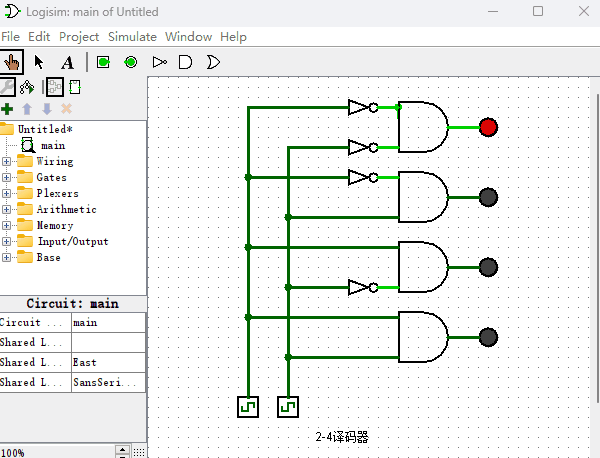
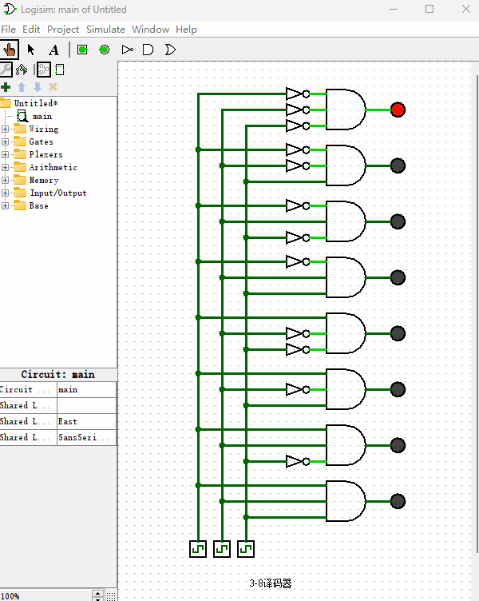
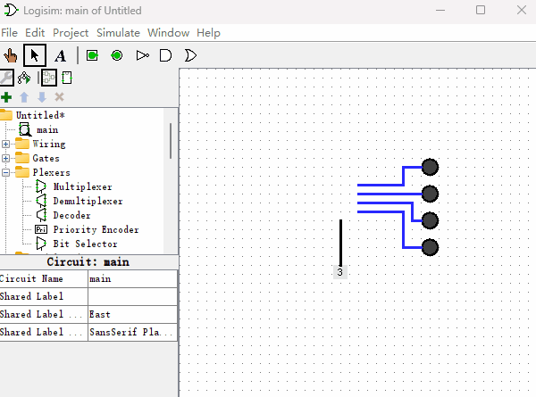

# 数字译码器

“数字译码器”是制作“只读存储器（ROM）”和“随机读写存储器（RAM）”的基础，首先我们来看下什么是“数字译码器”，以及如何使用逻辑门制作它。下图所示就是“数字译码器”的电路原理图。

上图就是用逻辑门组建的一个“2-4译码器”，顾名思义“2-4译码器”就是有两个输入端，4个输出端。那么我们再来看个3-8译码器长什么样子的？如下图所示。

你仔细看“数字译码器”的命名过程，就会发现，“第2个数字”正好是2的“第1个数字”次方。比如3-8译码器，8就等于2的3次方。如果你把下面的“时钟信号发生器”所代表的高低电平连在一起看成一个二进制数字，那么“数字译码器”所实现的功能就是当输入的二进制是几的时候，右侧第几个“发光二极管”就被点亮。其中发光二极管从上到下，我们规定最上面是第0个，然后往下数是第1个、第2个、第3个等等。它的工作原理是这样的：有2个位的二进制数通过0、1排列组合能组成4个数字00，01，10，11。由于与门只有两个输入端都为1的时候，输出才为1，我们可以在与门的两个输入端通过“加非门”和“不加非门”的各种排列组合的方法，从而导致只有一个“与门”结果能输出1。最后我们再调整下“与门”的位置，使得它们从上到下正好按照二进制数字大小来排成一列即可。

现在我想你已经了解了“数字译码器”的工作原理，由于Logisim软件已经内置了“数字译码器”这个元件，使用起来也更加便捷。当我们后面使用“数字译码器”的时候，可以直接从Logisim里拖拽出来使用即可。具体使用方式如下图所演示那样。和之前不同是，我把“时钟信号发生器”替换成了2位的“常量发生器”，直接修改“常量发生器”的值，可以更直观的感受“数字译码器”的工作过程。

