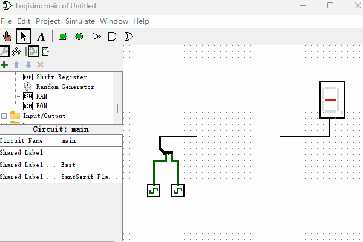

# 只读存储器

本节我们来制作一个“只读存储器”。“只读存储器”英文名叫Read-Only Memory，简称ROM。如果你曾经独立在个人电脑上安装过操作系统，接触过BIOS系统，也许你会听过“BIOS存储在ROM里面”这样的话，这里的ROM指的就是“只读存储器”。那么ROM到底是什么呢，你可以把它想象成一个U盘，出厂的时候数据就固定了，以后也不可以随意修改了。那么下面我们来看看如何用逻辑门电路来实现一个“只读存储器（ROM）”吧，电路图如下图所示。

初看这电路图似乎有点复杂，使用了这么多逻辑门，所以第一步你需要做的就是静下心来，慢慢的分析这个逻辑电路图。

我们看左侧包含4个“与门”的这部分，是不是很眼熟？没错，左侧部分就是上一节所讲到的“2-4译码器”。中间有4排分别由4个“与门”组成的电路结构，每个“与门”一端连接译码器，另一端连接一个“常量发射器”。最右侧通过一个或门把结果输出给“十六进制数码管”。那么这个“只读存储器”是如何工作的呢？

首先，我们先来回顾下“与门”的功能：
1. 当“与门”的一个输入端值为0的时候，另一个输入端无论值为多少，输出端都是0。
2. 当“与门”的一个输入端值为1的时候，输出端的结果就是另一个输入端的值。

所以，“与门”有个更加直观的功能解释，就是它具有信号“放行”功能，即它的一个输入端可以作为开关来控制另一个输入端的信号是否通过。

再回到刚才的“只读存储器”逻辑电路图中来，“译码器”输出结果控制着哪排“与门”信号能够通过，其它没通过的“与门排”输出结果都是0，最后通过“或门”的时候，也就只有“译码器”所选择的那排“与门”的信号了。而“只读存储器”中所存储的数据就是那些“常量发生器”所输出的值。例如，当左侧“数字译码器”的输入端为二进制的10的时候，第3排的二进制数据1001就被输出到右侧的“十六进制数码管”，结果显示9。按照字面来理解，只读存储器一旦写入出厂数据就不能修改了，实际上现在的“只读存储器”都已经支持出厂后再次修改数据了，但它依然不适合作为频繁修改数据使用的存储器。比如，我们用Logisim制作的这个“只读存储器”，如果我们想修改“只读存储器”里面的值该怎么做呢？只需要修改“常量发生器”的值即可。

最后，我们把左侧“数字译码器”的输入端重新起个名字，叫做“只读存储器”的“地址输入端”，右侧“或门”的输出端叫做“只读存储器”的“数据输出端”。那么这个“只读存储器”存储了哪些数据呢？我换一种形式把它整理成一个列表，数据使用二进制格式表示，如下图所示。

| 地址 | 数据 |
| :--: | :--: |
| 00 |  1000  |
| 01 |  0000  |
| 10 |  1001  |
| 11 |  0010  |

“只读存储器”的内容到此处就讲完了，你可能已经猜到了，Logisim已经内置了“只读存储器”元件，完成同样的电路功能，我们看看使用内置的“只读存储器”元件如何操作吧，演示动画如下图所示。我们可以看到在Logisim软件中使用“只读存储器”非常的方便，通过交互界面就可以修改以及预览“只读存储器”里面存储的数据，也可以很方便的修改数据位宽以及存储容量。

