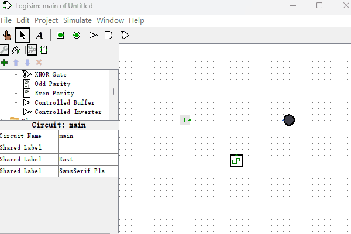

# 随机存取存储器

上一节的“只读存储器”有个缺点，就是当电路系统运行起来后，它就不适合再被频繁修改数据了。所以本节，我们来制作一个可以在电路运行的时候仍然可以频繁修改数据的元件，它叫做“随机存取存储器”，英文名称叫“Random Access Memory”，简称RAM。它还有一个通俗的叫法“内存”。因为要在电路运行的时候来修改数据，所以“随机存取存储器”的输入输出端会比较多，设计起来也会复杂些，它也是本章中最复杂的电路结构了。由于它的电路结构里使用了一种新的电子元件，所以在讲解它的电路结构之前，我们先认识下这种新的电子元件“断路控制器”。我们先看下它具有什么功能？如下图所示，“断路控制器”的功能就是，当控制端输入0时，他就变成了一个断开的导线，当控制端输入1时，他就变成了一个连通的导线。听上去很像个使用高低电平来控制的开关是吧？实际就是如此。

那么为什么要使用“断路控制器”呢？看上面实现的功能似乎用一个“与门”也可以完成这个功能啊？因为“与门”也有信号放行的功能。为了解释其中区别，我们先来看如下图左侧电路的这种情况。当一根导线上被同时输出0和1的时候，导线就变成红色，意味着电路报错了，在电路系统中不可以存在这种情况，因为这样就会造成系统短路。于是，我们可以像下图右侧电路那样，中间加上“断路控制器”，我们可以手动控制“断路控制器”的开关，来保证同时只能有一个输出信号连接到那根竖直的导线上。如果此时我们把“断路控制器”换成“与门”的话，是不能解决两个输出信号在同一个导线上造成冲突短路的问题。

有了“断路控制器”，现在我们开始制作“随机存取存储器”。如下图所示，这就是“随机存取存储器”的逻辑电路图。它的输入端分为两类：一类是多位数据信号类，由“数据输入”和“地址输入”组成；另一类是控制信号类，由“数据控制”、“地址控制”和“输出控制”组成。最右侧有一个数据输出端，连接到了“十六进制数码管”上。另外，左下方梯形的那个电子元件你还记得吗？它就是本章第一节讲过的“数字译码器”。

之所以把输入输出设计的这么复杂是因为我们要在电路运行的时候动态修改“随机存取存储器”里面的数据，这就需要使用更多的输入端才能完成这个功能。下面我来按步骤演示下如何在电路运行时，把“随机存取存储器”地址为1的数据修改成2。

1. 设置“地址输入”的值为1
2. 设置“地址控制”的值由0变1，地址保存在译码器前的触发器里。
3. 设置“数据输入”的值为2
4. 设置“数据控制”的值由0变1。到此，2就被保存在RAM的地址1处了。

接下来我再按步骤演示下如何在刚才电路上，把“随机存取存储器”地址为1的数据输出给“十六进制数码管”。

1. 设置“地址输入”的值为1
2. 设置“地址控制”的值由0变1，地址保存在译码器前的触发器里。
3. 设置“输出控制”的值为1。到此，地址1的数据就被输出到“十六进制数码管”了。

演示动画如下图所示。

看完演示动画，我们来分下RAM是如何存取数据的？首先，“数字译码器”和左侧的“与门列”是用来选择使用或存储哪个触发器，右侧的“与门列”和“断路控制器”共同控制哪个触发器的数据输出。具体细节就不赘述了，如果你仍然对此困惑，建议你把本书的演示例子下载到本机电脑，使用Logisim软件尝试放慢速度模拟并观察结果，这样有助于你更更快的理解它的工作原理。

最后，我们来看下如何用Logisim内置的“随机存取存储器”来完成同样的电路功能。由于内置的“随机存取存储器”和我们设计的不太相同，它把“数据输入”和“数据输出”都合并到数据输出端了。另外我们还要在地址输入端串联个触发器，这样就可以实现差不多的功能了，如下图所示。最后因为它的输入输出共用一个端口，所以在最后输出的效果上有些不同，其它存储过程都是一样的。后面当我们设计计算机系统的时候，这点区别不会造成影响，可以先忽略这点不同。

