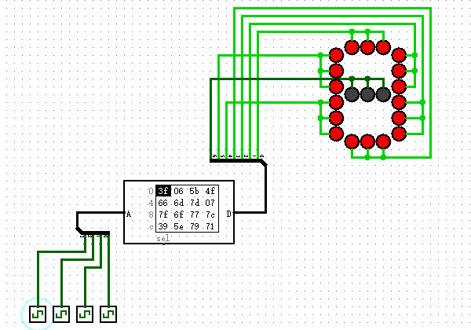

# 十六进制数码管

在前面的章节，为了更方便的观察数据，我们使用了“十六进制数码管”，那么我们能不能利用发光二极管自己制作一个呢？当然可以，我们可以使用“只读存储器”和一堆发光二极管来制作。你会不会有这样的疑惑“只读存储器不是用来存数据的吗？”。没错，ROM里面每个地址都会存储一个数据，我们也可以这样理解，每输入一个地址数据，就输出一个存储数据，这不就是一种数字之间的映射么？下面我们就利用ROM的映射原理来制作“十六进制数码管”，原理图如下图所示。

我们看到数码管确实能显示出正确的数字，那ROM里面应该如何存放数据呢？我们看到，数码管一共有七段，每段对应一个数据位。那么我们只要控制数据位的点亮、熄灭就可以控制二极管的显示了。比如，当地址输入为1的时候，只要数据的第1、2位为1（从右往左数，起始位从0开始），其它为0，即0000110，就可以显示出1的形状，那么我们只要地址1里面存入数据0000110即可。二进制的0000110等于十六进制的06，所以你可以在Logisim软件的ROM元件里看到，地址为1的数据恰好是06。
