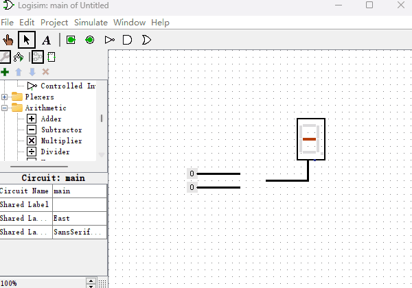
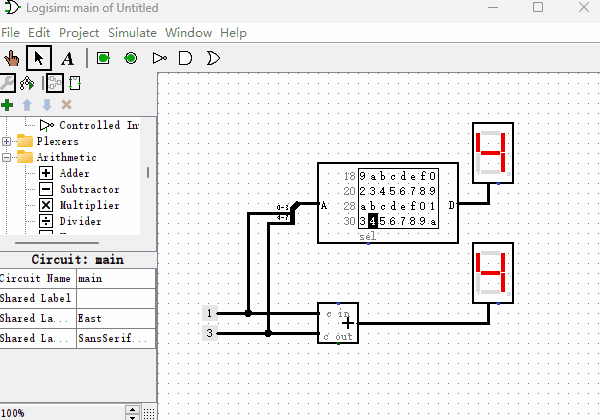
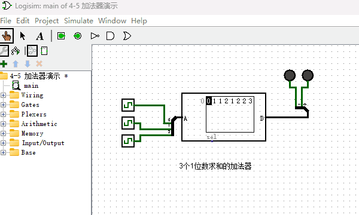
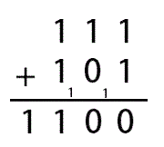
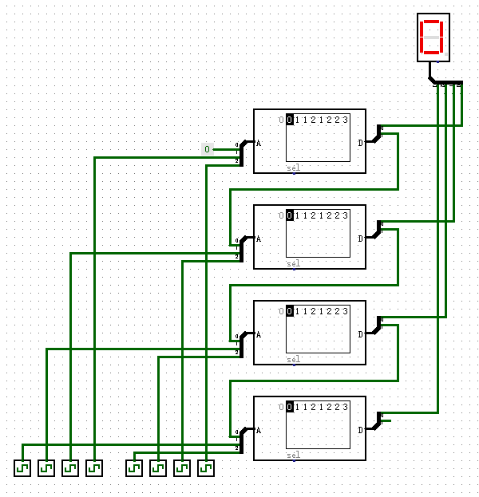

# 加法器

既然“只读存储器ROM”能够制作“十六进制数码管”，那么我们能不能利用它的映射功能再制作点其它的元件呢？本节我们来制作一个“加法器”，用于我们即将制作的计算机系统里。加法器是一种什么样的元件呢？Logisim里就有内置的加法器，它有两个输入端，一个输出端，输出端的结果就是两个输入端二进制数的求和。我现在用内置的加法器给你演示一下，如下图所示。

了解了加法器的功能，现在我们用“只读存储器”来制作一个“加法器”。先举个例子，如果想计算0110+0011的话，我们可以使用一个8位输入端，4位输出端的ROM，然后把两个二进制数字连接到一起，形成一个新的地址01100011，在地址01100011位置提前存储好它们两个相加的值即可。当我们把所有从0000到1111的各种排列组合的加法都提前存储到对应的地址中，加法器就制作完成了。虽然看上去是个很笨拙的办法，但是当加法器数据位数不多的时候，是不成问题的。下面我们看一下4位的加法器所使用的ROM里面是如何存放数据的？如下图所示，我们随机挑选几个地址的值验证下，地址0x00里数据为0x0（以0x开头的数字，代表是十六进制数字），因为0+0=0，所以值也是0。地址0x43里数据为0x7，0x43的二进制为01000011，0100+0011等于0111，即0x7。

## 带进位的加法器（拓展内容）

通过上述方式制作的加法器虽然可以正常工作，但非常耗费ROM的存储空间。下面我介绍另外一种实现加法器的方法，它仅仅使用少量的ROM存储空间即可。首先我们制作出如下图所示的加法器，注意看，它有3个输入端。它完成的功能是把3个1位数进行求和，因为3个1位数相加结果最大的时候就是1+1+1=11（二进制），所以输出端设计为2位。

还记得2个十进制多位数字是如何计算加法的么？当2个对应位相加大于9的时候，就向左进一位。2个二进制数字相加原理也是相同的，比如我想计算二进制111+101等于几，可以按照如下图所示方式计算。

现在我们把刚才的3输入端1位加法器分别拿出一个输入输出端当作进位使用，然后使用4个这种加法器，把它们的进位端串联在一起，如下图所示，就完成了一个4位加法器的功能。从图中右下角处，我们可以看到，我们舍弃了输出端最高的进位，这样就保持了输入输出端的数据位数相同，都是4位。通过这种方式，即使我们制作一个64位的加法器，也是不会消耗太多的ROM存储空间。

