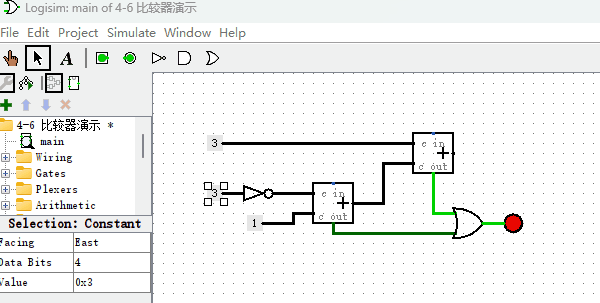

# 比较器
按照上一节使用ROM制作“加法器”的原理，我们可以制作出各种各样2个数字相关操作的元件，比如各种算数运算元件如“减法器”、“乘法器”、“除法器”等，再比如各种位运算元件如“按位与”、“按位或”、“移位”等。也就是说，所有的多输入单输出的元件都可以使用这种方式来做，只是它需要付出巨大的存储容量作为代价。

本节我们再用同样的方法来制作一个“比较器”，以支持后续计算机指令能够实现条件跳转的功能。顾名思义，“比较器”就是比较两个数字大小的一种元件，它有2个输入端，1个输出端。我们设计的这个4位比较器，有2个4位输入端，1个1位输出端。当“输入端1”的数据大于等于“输入端2”的数据，输出1，否则输出0。其原理图如下图所示，作为对比，我把内置的比较器也并联在一起，方便观察对比结果。

## 使用加法器来制作比较器（拓展内容）

同上一章节类似，通过上述方式制作的比较器虽然可以正常工作，但也会耗费大量的ROM的存储空间。下面我介绍另外一种实现比较器的方法，它主要使用两个加法器即可。首先我先来讲解下原理：

> 假设“4位比较器”的输入端数字分别为A和B，4位二进制数字能表示的最大数字就是15，如果数到16就会进位溢出。考虑公式A+16-B，当A小于B的时候，结果一定小于16，不会溢出，当A大于等于B的时候，结果就大于等于16，会溢出。那么我们就可以通过溢出位来判断A和B的大小，换句话说，当A小于B的时候，溢出位为0，否则为1。那么公式A+16-B应该如何用逻辑电路实现呢？首先，我们可以计算16-B，16-B等于把B的每一位取反再加1。为什么呢？因为1个4位数字和1个把它每一位取反的数字相加正好等于二进制的1111，即十进制的15。于是15-B等于把B的每一位取反，16-B就等于把B的每一位取反再加1。计算出16-B的结果，最后再与A相加就完成了A+16-B的计算。

了解原理后，我们看下如何制作电路图，如下图所示。

从图中可以看出，“非门”完成了数字中每一位取反的功能，加法器用来计算两个数字求和功能，基本上和我们的公式原理一模一样。但这里需要注意的是，两步加法都有可能导致加法溢出，所以，我们用或门把两个加法器的“进位”结果连在一起，表示，只要其中一个加法器发生进位溢出，那么结果就是溢出。