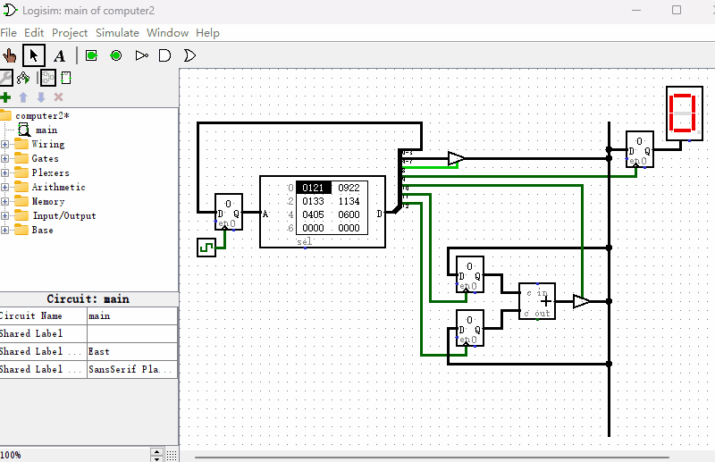

# 制作一个能做加法运算的计算机

上一节我们制作的计算机只能通过指令来控制“十六进制数码管”的显示。本节，我们来把电路稍稍改造成如下图所示的样子，增加一个加法器，并在“加法器”和“十六进制数码管”的输入端串联一个“触发器”用来缓存数据。同时我们增加了一根竖直的导线，把各种元件统一连接在一起，起到汇总的作用，所以它还有个名字，叫做“总线”。另外，由于加法器的输出和ROM数据的输出同时连接到总线上，所以我们使用了“断路控制器”通过信号控制来防止它们同时起作用而造成短路现象。

现在我们开始编写指令来实现2+3运算，并把结果显示在“十六进制数码管”上。在编写指令之前，我们先来看下“只读存储器”多出来的输出端都是做什么的。
* D3~D0和前一节相同，输出下一条指令的地址
* D7~D4和前一节相同，输出指令中携带的数据
* D8控制D7~D4是否连接到总线上
* D9控制总线数据是否传输到“十六进制数码管”的寄存器中。
* D10控制加法器的输出端是否连接到总线上
* D11控制总线数据是否传输到加法器的输入端1
* D12控制总线数据是否传输到加法器的输入端2

这次“只读存储器”多出来的输出端D12~D8全部都是控制信号，主要负责各个元件的输入输出端何时连接到总线，用以完成各种复杂功能。我把编写好的用以实现2+3运算的指令列在如下的表格中。

|地址|D3~D0|D7~D4|D8|D9|D10|D11|D12|十六进制|
|-|-|-|-|-|-|-|-|-|
|0000|0001|0010|1|0|0|0|0|0x121|
|0001|0010|0010|1|0|0|1|0|0x922|
|0010|0011|0011|1|0|0|0|0|0x133|
|0011|0100|0011|1|0|0|0|1|0x1134|
|0100|0101|0000|0|0|1|0|0|0x405|
|0101|0000|0000|0|1|1|0|0|0x600|

我们来逐条分析下这些指令是如何工作的：

* 地址0000：设置D8=1，使D7~D4的数据0010传送到总线
* 地址0001：设置D11=1使加法器的“输入端1”由0变成1，总线数据0010被保存到加法器的寄存器1里
* 地址0010：设置D8=1，使D7~D4的数据0011传送到总线
* 地址0011：设置D12=1使加法器的“输入端2”由0变成1，总线数据0011被传送到加法器的寄存器2里
* 地址0100：设置D10=1，使加法器输出的计算的结果传送到总线
* 地址0101：设置D9=1，把总线数据传送给“十六进制数码管”显示出来

最终它的演示动画如下图所示。

