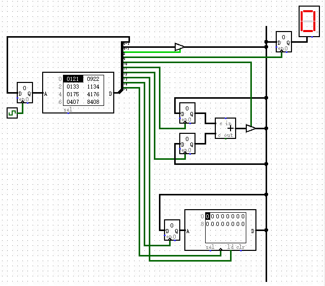
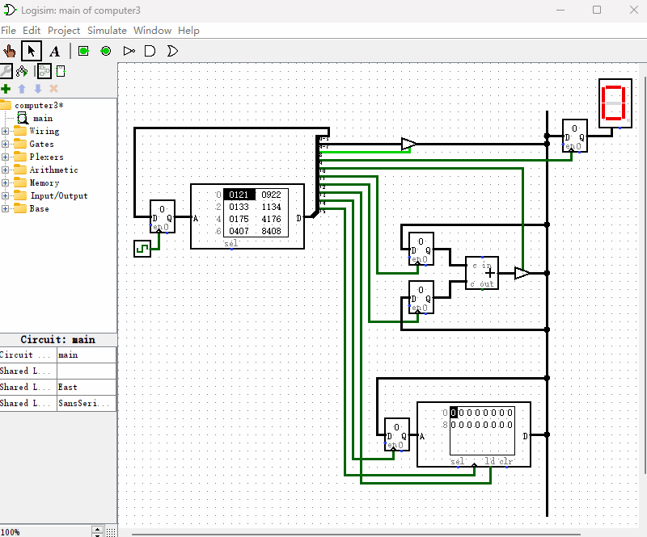

# 制作一个带有内存的计算机

上一节我们制作的计算机能够计算2+3了，但我又想到了个新问题：如果我现在想先计算2+3，再计算1+2，然后再把它们的结果进行相加，最后的计算结果显示到“十六进制数码管”上，该怎么设计“只读存储器”的指令呢？这时，我们就需要一个临时存储中间计算结果的地方了，我们可以再给前面章节的计算机增加一个内存，即“随机存取存储器”，其逻辑电路图如下图所示。

和前一节相比，我们改动比较简单，只增加了一个“随机存取存储器”，并给“只读存储器”增加了3个输出端用于控制“随机存取存储器”的数据读写。我们先来看下“只读存储器”多出来的输出端都是做什么的。
* D12~D0和前一节功能相同，不再赘述
* D13控制内存的输出端是否连接到总线上
* D14控制总线数据是否传输到内存的地址输入端
* D15控制总线数据是否传输到内存的数据输入端

现在我们开始编写指令来实现这样一个功能，把2+3的运算结果保存到内存的地址0x7处，并把内存地址0x7处保存的数据通过总线显示在“十六进制数码管”上。我把编写好的指令绘制在如下的表格中。

|地址|D3~D0|D7~D4|D8|D9|D10|D11|D12|D13|D14|D15|十六进制|
|-|-|-|-|-|-|-|-|-|-|-|-|
|0000|0001|0010|1|0|0|0|0|0|0|0|0x121|
|0001|0010|0010|1|0|0|1|0|0|0|0|0x922|
|0010|0011|0011|1|0|0|0|0|0|0|0|0x133|
|0011|0100|0011|1|0|0|0|1|0|0|0|0x1134|
|0100|0101|0111|1|0|0|0|0|0|0|0|0x175|
|0101|0110|0111|1|0|0|0|0|0|1|0|0x4176|
|0110|0111|0000|0|0|1|0|0|0|0|0|0x407|
|0111|1000|0000|0|0|1|0|0|0|0|1|0x8408|
|1000|1001|0000|0|0|0|0|0|1|0|0|0x2009|
|1001|1001|0000|0|1|0|0|0|1|0|0|0x2209|

我们来逐条分析下这些指令是如何工作的。

* 地址0000：设置D8=1，使D7~D4的数据0010传送到总线
* 地址0001：设置D11=1使加法器的“输入端1”由0变成1，总线数据0010被保存到加法器的寄存器1里
* 地址0010：设置D8=1，使D7~D4的数据0011传送到总线
* 地址0011：设置D12=1使加法器的“输入端2”由0变成1，总线数据0011被传送到加法器的寄存器2里
* 地址0100：设置D8=1，使D7~D4的数据0111传送到总线
* 地址0101：设置D14=1，把总线数据传送给内存的地址输入端
* 地址0110：设置D10=1，使加法器输出的计算的结果传送到总线
* 地址0111：设置D15=1，把总线数据传送给内存的数据输入端完成保存
* 地址1000：设置D13=1，把内存数据传输到总线上
* 地址1001：设置D9=1，把总线数据传送给“十六进制数码管”显示出来

它的演示动画如下图所示。

