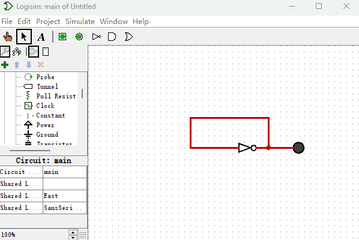
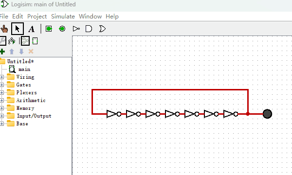
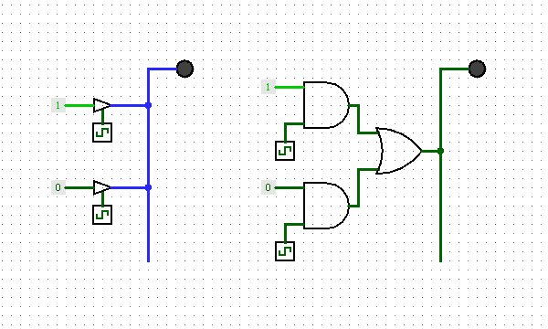

# 制作一个带按键输入的计算机

到目前为止，我们制作的计算机系统已经比较完整了，再加上一个输入设备就更完美了。所以，本节我们就给它增加两个按钮作为按键输入，有点类似电脑键盘的功能。和前一节电路结构相比，改动很小，我们只增加了2个按钮和一个“断路控制器”即可，其电路图如下图所示。

我们给“只读存储器”增加了1个输出端用于控制“按钮”的数据输出。“断路控制器”的作用是防止多个信号同时输入到总线，而导致系统短路的情况发生。“断路控制器”由ROM中的D19来控制，它的作用是控制“按钮数据”是否连接到总线上。

现在我们编写指令来实现这样一个功能：当按下任何一个按钮时，就把按钮对应的数值呈现在“十六进制数码管”上。很简单的一个功能吧，我把编写好的指令绘制在如下的表格中。

|地址|D3\~D0|D7\~D4|D8|D9|D10\~D18|D19|十六进制|
|-|-|-|-|-|-|-|-|
|0000|0001|0000|0|0|000000000|1|0x80001|
|0001|0010|0000|0|1|000000000|1|0x80202|
|0010|0000|0000|0|0|000000000|0|0x0|

我们来逐条分析下这些指令是如何工作的。

    地址0000：设置D19=1，使“按钮”的数据传送到总线
    地址0010：设置D9=1，把总线数据传送给“十六进制数码管”显示出来
    地址0010：跳转到地址0000，重新开始循环

它的演示动画如下图所示。

到此为止，我们整个计算机系统就讲完了。回顾一下，我们最终制作的计算机电路所使用的基础电子元件是不是只有逻辑门？我们用“逻辑门”制作了“锁存器”和“触发器”，而后使用“逻辑门”和“触发器”共同制作出了ROM、RAM等集成度更高的电子元件，最后使用它们组装成了一台4位的台计算机。也许细心的你会有疑问“我们的电路中不是还使用了一个时钟信号发生器和一个断路控制器么？”。其实这两个电子元件我们也可以使用逻辑门来实现同样的功能。我们先来看“时钟信号发生器”如何使用“逻辑门”来制作？首先回顾下我们之前讲过的一种报错电路，如下图所示。

该电路由于产生了高频率的震荡信号，被Logisim软件停止仿真并报错。那么我们有没有办法把它的频率降低，比如降到4000HZ，这样Logisim软件就不会把它当成错误来看待了？其实很简单，我们知道信号经过逻辑门会有延时，只要我们串联成千上万个“非门”，就可以制作任何频率的“时钟信号发生器”了。就像下图所示的样子，只是由于电路图太小，我只使用了7个“非门”串联来演示一下。

其次，我们再看看如何使用“逻辑门”来替代电路中的“断路控制器”。我们知道，在电路中使用“断路控制器”的目的是通过它控制所有元件同时只能有一个元件被允许输出信号到总线，这样做可以防止出现两个信号不一致的元件同时输出到一根总线上，从而造成电路短路的问题。其实我们使用逻辑门同样可以解决这个问题。如下图所示，我使用“断路控制器”和“逻辑门”来作为对比。

至此，我们仅仅使用了“逻辑门”这个最基本的元件，从无到有的构建了一个计算机系统。而所有逻辑门都可以用“非门”和“或门”的串并联组合来获得，也就是说，只要我们有足够的“非门”和“或门”，就可以构筑起一个庞大的计算机帝国了。回想一下我最开始提到的三体中“举旗帜的士兵”，我的世界中的“红石火把”，它们本质上不就是逻辑门么？