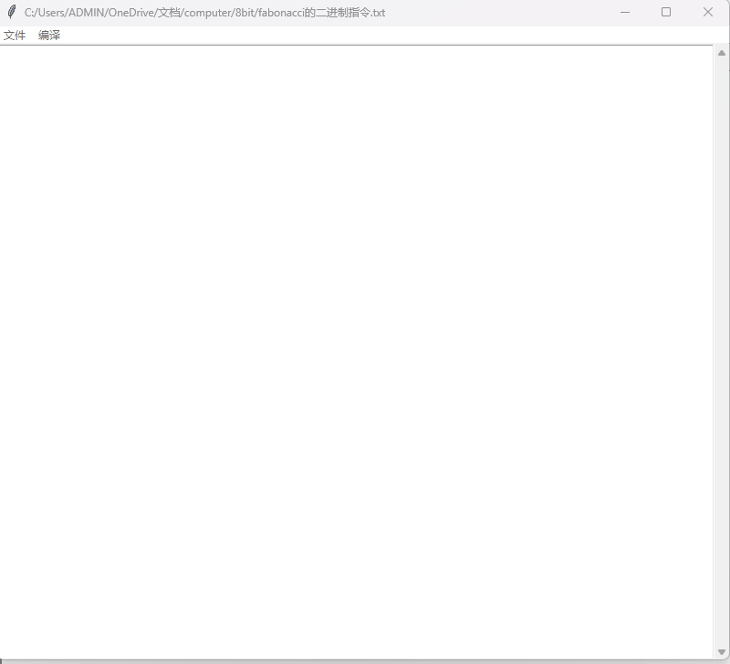

# fabonacci数列
本节我们来用计算机来解决一个数学问题，虽然还无法像图灵那样完成那么伟大的成就，但确实可以把一些复杂的计算交给计算机来做，比如计算fabonacci数列。那么什么是fabonacci数列？我列出fabonacci数列前面几个数你一眼就能看明白了：1，1，2，3，5，8，13，21……。这个数列中每个数等于前面两个数相加，现在我想算出第100个数字是多少，该怎么办？我们可以把它交给计算机来做，然后我们只要在旁边喝一杯茶等待计算机的最终结果就好了。这里我使用前一章由我们设计的汇编语言编写了一个计算fabonacci数列的程序，其汇编代码如下所示。

```
  MOV [0], 0               //注释：把地址0的内存设置0
  MOV [1], 1               //注释：把地址1的内存设置1
  MOV [6], 1               //注释：把地址6的内存设置1
  MOV [7], 1               //注释：把地址7的内存设置1
  MOV [8], 0               //注释：把地址8的内存设置0
  MOV [11], 0              //注释：把地址11的内存设置0，用来计数
  MOV [12], 10             //注释：把地址12的内存设置10，用来控制循环次数
LOOP:
  ADD [8], [6], [7]        //注释：把内存地址6和7处的值相加，保存到地址8处
  ADD [6], [7], [0]        //注释：因为内存[0]值为0，相当把内存7复制到内存6
  ADD [7], [8], [0]        //注释：因为内存[0]值为0，相当把内存8复制到内存7
  ADD [11], [11], [1]      //注释：因为内存[1]值为1，所以循环计数加1
  JUMPIF EXIT, [11], [12]  //注释：判断是否满足条件跳出循环
  JUMP LOOP
EXIT:
  OUT [7]                  //注释：把计算结果显示到十六进制数码管
```
当我们把上述汇编代码转换成二进制指令后发现，它生成了几十条指令，而我们设计的计算机是4位的，它的ROM最多只能存放16条指令。所以，我把我们的计算机所有输入输出都改成了8位的，这里不过多解释它是如何改造的了，因为在Logisim软件里修改数据位的宽度比较简单，都是内置提供的功能。当改成8位后，其电路图基本上没有任何变化，只有“十六进制数码管”那里有些变化，因为一个数码管只能表示低4位数据，所以又增加了一个数码管表示高4位数据。使用新的8位计算机后，再来运行上述的汇编代码，它的演示动画如下图所示。



另外，我用python也实现了一模一样的功能，代码如下所示。如果你已经有编程基础，可以感受下两者之间的联系。

```python
	var0 = 0
	var1 = 1
	var6 = 1
	var7 = 1
	var8 = 0
	var11 = 0
	var12 = 10
	while True:
		var8 = var6 + var7
		var6 = var7 + var0
		var7 = var8 + var0
		var11 = var11 + var1
		if var11 >= var12:
			break
	print(var7)
```
